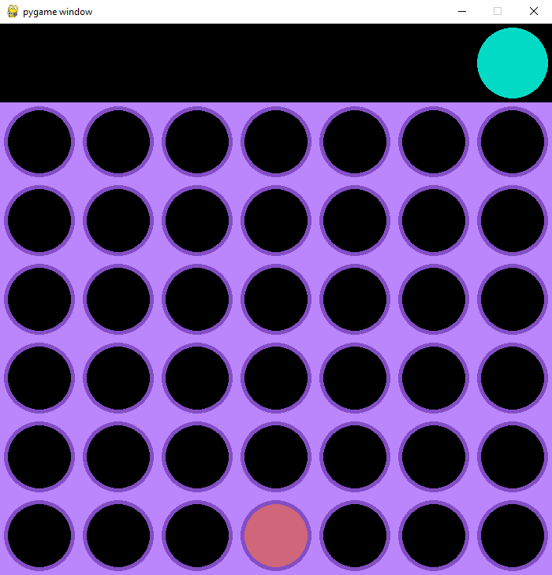

# Connect 4

- A Game you can play locally with a friend or against a computer
- Created with Python and pygame

# How To Setup

- Clone this repo
- Run `python .\connect4.py`

# How To Play

## Home Screen

- Here you're able to pick between 1 and 2 players

## Options

- Here you can adjust the board size

## Gameplay

- The goal of the game is to get 4 in a row
- This can be diagonal, horizontal, or vertical
- If the board is fully filled with pieces without any wins, then it's a Cat's Game (Tie)

## End

- Try Again will restart the game with the same settings
- Menu will bring you back to the Home Screen

# Improvements/Future Features

- Adding a randomizer for who starts
- Improve AI latency
- Improve AI board value accuracy
- Clean up code
